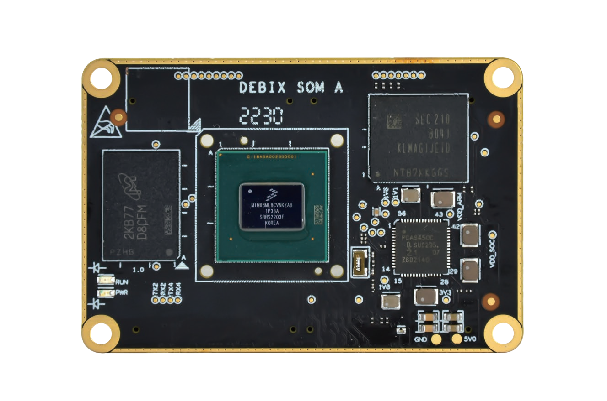
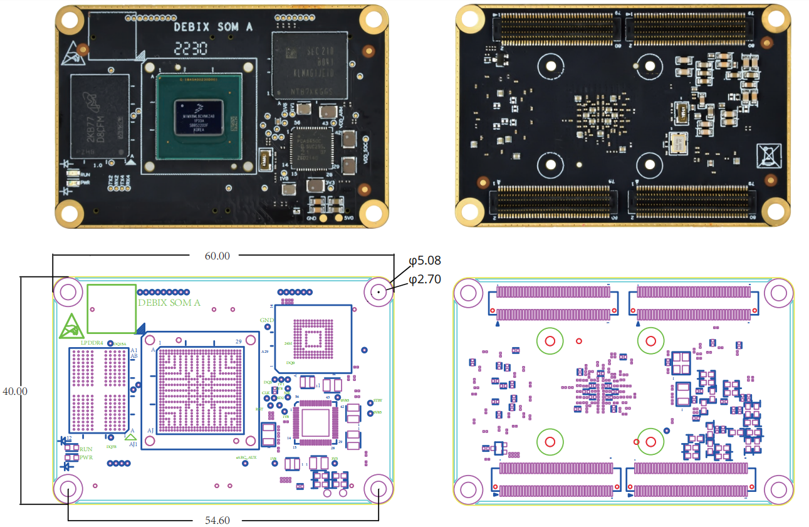
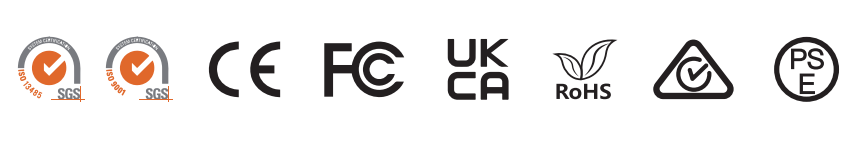

# DEBIX SOM A i.MX 8M Plus Core Board
 

## Overview
DEBIX SOM A is the first System on Module product of the DEBIX series. As with the DEBIX Model A SBC, it is based on NXP i.MX 8M Plus CPU with a 2.3 TOPS NPU, which brings us the same powerful system performance. This core board design has some notable benefits, such as design reutilization, reduction of development time of the carrier boards, and flexible integration into various embedded systems.

## Main Features
- **Industrial-grade performance:** Designed for demanding applications in Industry 4.0,
IoT, smart cities, and multimedia.
- **Comprehensive software support:** Includes Yocto-L6.1.22_2.2.0, Ubuntu 22.04,
Debian 12, Windows 10 IoT Enterprise, Android, OpenWRT and FreeRTOS operating 
systems, along with basic software for fast and direct applications.
- **Real-time control:** Cortex-M7 core for real-time responsiveness, supported by robust
control networks like CAN FD and dual Gigabit Ethernets (one with TSN capability).
- **Advanced vision system:** Dual Image Signal Processors (ISPs) and dual camera inputs
for efficient image processing and analysis.
- **Advanced Multimedia:** 1080p60 video encode/decode (H.265/H.264), 3D/2D graphics
acceleration, and multiple audio/voice functionalities.

## Specification
| System          |                                                                         |
|-----------------|-------------------------------------------------------------------------|
| CPU             | NXP i.MX 8M Plus (default), 4 x Cortex-A53, comes with an integrated neural rocessing unit (NPU) that delivers up to 2.3 TOPS. Industrial grade CPU runs at 1.6GHz, and commercial grade CPU runs at up to 1.8GHz. (i.MX 8M Plus series CPU optional)            |
| Memory          | 2GB LPDDR4 (1GB/4GB optional, while 8GB is optional when operating temp. is -20°C to 70°C)|
| Flash           | Onboard 16GB eMMC (8GB/32GB/64GB/128GB/256GB optional)                  |
| OS              | Ubuntu22.04, Yocto-L6.1.22_2.2.0, Debian 12, Windows 10 IoT Enterprise (also supports Android, OpenWRT, FreeeRTOS) *Note: 4GB/8GB LPDDR4 supports Windows 10 IoT, recommend 8GB version.*|
|**I/O Interfaces**|                                                                      
| Gigabit Ethernet| 2 x Gigabit Ethernet controller, one of them supports Time Sensitive Networking (TSN) |
|DIsplay          | 1 x HDMI 2.0a, support 3840 x 2160@30Hz, 1920 x 1080@120Hz, 1920 x 1080@ 60Hz 1 x LVDS, support 4-lane and 8-lane 1 x MIPI DSI, support 2560 x 1080@60Hz       |
| Camera          | 1 x MIPI CSI (4-lane)                                                   |
| Audio           | Up to 6 x SAI (synchronous audio interface), HiFi4 DSP, 1 x SPDIF IN, 1 x SPDIF OUT *(Note: 1 x SAI with 8 TX and 8 RX lanes, 1 x SAI with 4 TX and 4 RX lanes, 2 x SAI with 2 TX and 2 RX lanes, 2 x SAI with 1 TX and 1RX lane, all SAIs support I2S and AC97)*             |
| USB             | 2 x USB 3.0, configurable as device or host                             |
| UART            | Up to 4 x UART                                                          |
| I2C             | Up to 6 x I2C, I2C2~I2C6 are exposed to the connectors (2 of the five I2Cs are multiplexed as SD1). I2C1 is not allowed to be configured.                                  |
| SDIO            | 2 x SDIO                                                                |
| SPI             | Up to 3 x ECSPI                                                         |
| PCIe            | 1 x PCIe Gen3 1-lane                                                    |
| CAN             | 2 x CAN                                                                 |
| GPIO            | 13 x GPIO for default, other functional pins can be configured as GPIO through software |
|**Power Supply**|
| Power Supply    | 3.5V~5V/2A                                                              |
|**Operating Temperature**|
Temp. Range       | -20°C~70°C for default, -40°C~85°C optional                             |
|**Mechanical**|
| Connector       | 4 x Double-sided board-to-board connector (model number BB51024A-R80-10-32), 2 x 40pin/0.5mm pitch, matching sockets of various heights |
| Dimension       | 60mm(L) x 40mm(W) x 5.6mm(H)                                            |
| Gross Weight    | 23g(±0.5g)                                                              |
| Net Weight      | 11g(±0.5g)                                                              |

## Product Version
| Version | CPU | NPU | VPU | ISP | HiFi 4 |
|---------|-----|-----|-----|-----|--------|
| DEBIX SOM A Standard | NXP i.MX 8M Plus |1|1|1|1|
| DEBI SOM A Lite | NXP i.MX 8M Plus Quad Lite | N/A | N/A | N/A | N/A | 

## I/O Interfaces:

## Ordering Codes
| RAM Size | eMMC Storage | PN for SOM A (-20°C~70°C) | PN for SOM A Lite (-20°C~70°C)| PN for SOM A (-40°C~85°C)  | PN for SOM A Lite (-40°C~85°C)  |
|---|---|---|---|---|---|
| **1GB DDR** | 8GB        | SOM A-D1E8              | SOM A Lite-D1E8              | SOM A-I-D1E8             | SOM A Lite-I-D1E8             |
|          | 16GB       | SOM A-D1E16             | SOM A Lite-D1E16             | SOM A-I-D1E16            | SOM A Lite-I-D1E16            |
|          | 32GB       | SOM A-D1E32             | SOM A Lite-D1E32             | SOM A-I-D1E32            | SOM A Lite-I-D1E32            |
|          | 64GB       | SOM A-D1E64             | SOM A Lite-D1E64             | SOM A-I-D1E64            | SOM A Lite-I-D1E64            |
| **2GB DDR** | 8GB        | SOM A-D2E8              | SOM A Lite-D2E8              | SOM A-I-D2E8             | SOM A Lite-I-D2E8             |
|          | 16GB       | SOM A-D2E16             | SOM A Lite-D2E16             | SOM A-I-D2E16            | SOM A Lite-I-D2E16            |
|          | 32GB       | SOM A-D2E32             | SOM A Lite-D2E32             | SOM A-I-D2E32            | SOM A Lite-I-D2E32            |
|          | 64GB       | SOM A-D2E64             | SOM A Lite-D2E64             | SOM A-I-D1E64            | SOM A Lite-I-D2E64            |
| **4GB DDR** | 8GB        | SOM A-D4E8              | SOM A Lite-D4E8              | SOM A-I-D4E8             | SOM A Lite-I-D4E8             |
|          | 16GB       | SOM A-D4E16             | SOM A Lite-D4E16             | SOM A-I-D4E16            | SOM A Lite-I-D4E16            |
|          | 32GB       | SOM A-D4E32             | SOM A Lite-D4E32             | SOM A-I-D4E32            | SOM A Lite-I-D4E32            |
|          | 64GB       | SOM A-D4E64             | SOM A Lite-D4E64             | SOM A-I-D4E64            | SOM A Lite-I-D4E64            |
| **8GB DDR** | 8GB        | SOM A-D8E8              | SOM A Lite-D8E8              |                         |                              |
|          | 16GB       | SOM A-D8E16             | SOM A Lite-D8E16             |                         |                              |
|          | 32GB       | SOM A-D8E32             | SOM A Lite-D8E32             |                         |                              |
|          | 64GB       | SOM A-D8E64             | SOM A Lite-D8E64             |                         |                              |

## Compatible with DEBIX's Accessories
| Product                     | Model               |
|-----------------------------|---------------------|
| SOM A I/O Board            | BMB-08               |
| Camera Adapter Board       | EMB-AS-08          |
| DEBIX Camera Modules       | Camera 200A; Camera 500A; Camera 1300A |
| DEBIX Display Screens      | DEBIX TD050A; DEBIX TD070A; DEBIX TD101A; DEBIX TD050H; DEBIX TD070H; DEBIX TD101H |

## Safety Instructions and Warnings:
**General:**
- Avoid exposure to water, moisture and conductive surfaces while operating.
- Handle with care to avoid mechanical or electrical damage to the circuit board and connectors.
- Only handle the board by the edges when powered on to minimize the risk of electrostatic discharge damage.

**Power:**
- Only use the product with a DEBIX SOM A and a 12V/2A DC external power supply that complies with relevant regulations and standards for your country.

**Environment:**
- Operate in a well-ventilated environment, even if using a case.
- Place on a stable, flat, non-conductive surface and avoid contact with conductive items.

**Connections:**
- Only connect compatible devices to the GPIO ports to avoid damage and warranty
voiding.
- Use peripherals that comply with relevant standards for the country of use and ensure proper insulation and operation.

**Additional notes:**
- This summary is not exhaustive, please refer to the full User Manual for details.
- If you are unsure about any aspect of safety or operation, consult a qualified
professional.

## Contact Us
- **Headquarters**: DEBIX Technology Inc., 8345 Gold River Ct., Las Vegas, NV 89113, USA  
- **Factory**: 5-6/F., East Zone, Shunheda A2 Building, Liqxiandong Industrial Park, XiLi, Nanshan Dist., Shenzhen, China  
- **Email**: info@debix.io  
- **Website**: [www.debix.io](https://www.debix.io)  
- **Community**: [Discord](https://discord.com/invite/adaHHaDkH2)